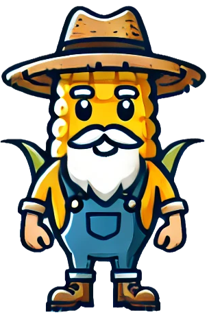
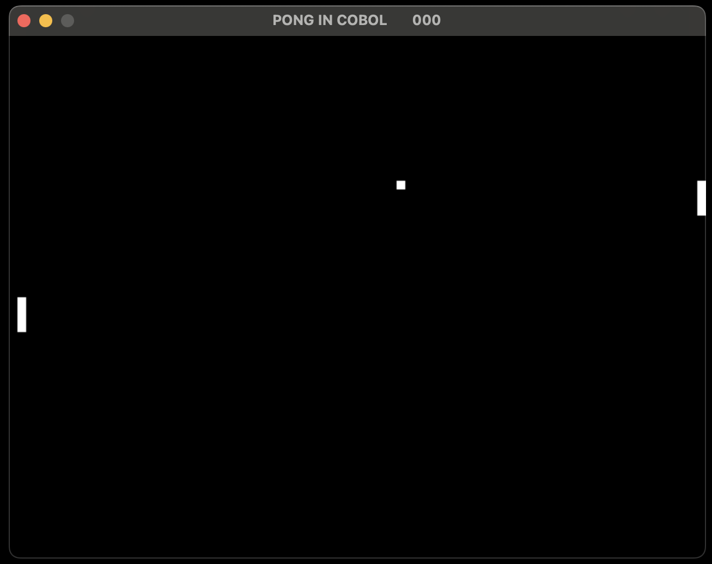

# COB OL' Engine



A game engine written in COBOL based on the SDL2 library.

Because WHY NOT?

## Requirements
You need SDL2, SDL2_ttf and SDL2_image.

On macOS you can install them using brew:
```bash
brew install sdl2 sdl2_ttf sd2_image
```

For more details on how to install SDL2, SDL2_ttf and SDL2_image, please refer to the following links:

https://wiki.libsdl.org/SDL2/Installation

## Usage
For now, it's just a list of utilities wrapping SDL2 library functions in COBOL.
You can find them in the `engine` folder.

If you want to see them in action, there's a simple example in the `examples` folder.

To run it, navigate to the `examples/pong` folder and run the following commands:

### Compiling
```bash
make
```

### Running
```bash
make run
```

Here's PONG in Cobol!




## Huge thanks
The base of this project was inspired by the following repository:
https://github.com/oshaboy/SDL-COBOL-DEMO

### Also inspired by
https://github.com/azac/cobol-on-wheelchair
